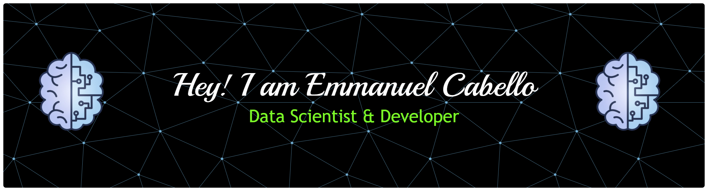

<h1 align="center">Hi 👋, I'm Emmanuel Cabello</h1>
<h3 align="center">A passionate developer from Paraguay</h3>

  

  

- 🔭 I’m currently working on **Penguin Code Pro BOOTCAMP**

- 🌱 I’m currently learning **Data Science and Machine Learning**

- 👯 I’m looking to collaborate on **Others projects**

- 🤝 I’m looking for help with **improve my skills in cibersecurity**

- 💬 Ask me about **Python**

- 📫 How to reach me **emmanuelrcabellop056@gmail.com**

- ⚡ Fun fact **1% better every day**

<h3 align="left">Connect with me:</h3>

<h2 align="center">🧠 Tools & Technologies I Use</h2>

  
  
  
  
  
  
  
  
  
  
  
  
  
  
  
  
  
  
  
  
  
  
  
  
  
  
  
  
  
  
  
  
  
  
  
  
  
  
  

